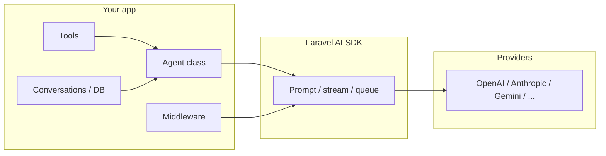

# Laravel AI SDK — learning guide and topic index

This folder is a **structured curriculum** for the [Laravel AI SDK](https://laravel.com/docs/ai) (`laravel/ai`). It complements the official documentation with **numbered topic guides**, **cross-links**, and **working examples** in this repository so you can learn concepts in order and see them in code.

**How to use this README**

1. Read [What the SDK is (mental model)](#what-the-laravel-ai-sdk-is-mental-model) once.
2. Follow [The full learning path](#full-learning-path-beginner-to-advanced) from top to bottom (or jump to a phase if you already know the basics).
3. Open the linked `topics/*.md` file for each number for explanations, patterns, and pointers into this app’s Livewire demos and agents.
4. Keep [Provider support by feature](#provider-support-by-feature) and [Environment keys](#environment-keys-quick-reference) nearby while you experiment.

---

## What the Laravel AI SDK is (mental model)

The SDK gives you one **Laravel-native API** for multiple AI vendors (OpenAI, Anthropic, Gemini, and others). The central idea is an **agent**: a PHP class that bundles **instructions**, optional **conversation history**, **tools**, **structured output schemas**, and **middleware**. You **prompt** an agent (sync, streamed, or queued) and get **text**, **structured data**, or **stream events**—plus optional **images**, **audio**, **transcriptions**, **embeddings**, **reranking**, **file storage**, and **vector stores** for RAG.

**Typical real use cases**

| Use case | Main SDK pieces | Topic starting point |
| --- | --- | --- |
| Chatbot with memory | `RemembersConversations`, or custom `messages()` | [08](topics/08-remembers-conversations.md), [07](topics/07-conversational-messages.md) |
| Extract JSON from unstructured text | `HasStructuredOutput`, `schema()` | [09](topics/09-structured-output.md) |
| “Search our docs then answer” | Embeddings + pgvector + `SimilaritySearch` tool | [28](topics/28-embeddings.md) → [29](topics/29-pgvector-and-queries.md) → [16](topics/16-similarity-search.md) |
| Agent that can browse / fetch URLs | Provider tools `WebSearch`, `WebFetch` | [17](topics/17-provider-tool-web-search.md), [18](topics/18-provider-tool-web-fetch.md) |
| RAG over uploaded files in a vector store | `Files`, `Stores`, `FileSearch` | [32](topics/32-files-with-providers.md) → [33](topics/33-vector-stores.md) → [19](topics/19-provider-tool-file-search.md) |
| Resilience when an API is down | Failover: `provider: [Lab::A, Lab::B]` | [24](topics/24-failover.md) |
| Compliance / logging before model calls | Agent middleware | [20](topics/20-agent-middleware.md) |

---

## Full learning path (beginner to advanced)

Work through **01 → 35** in order the first time; later, use phases as reference.

### Phase A — Install and configure

| # | Topic | You learn | Example in this repo |
| --- | --- | --- | --- |
| [01](topics/01-installation-and-migrations.md) | Installation and migrations | Composer package, publishing config/migrations, `agent_conversations` tables | Run migrations; see `/chat` once auth works |
| [02](topics/02-configuration-and-env.md) | Configuration and env | `config/ai.php`, defaults per modality (text, image, embeddings, …) | `config/ai.php` |
| [03](topics/03-providers-and-lab-enum.md) | Providers and `Lab` enum | Typed `Lab::OpenAI` instead of raw strings; switching providers | Demos use configured default provider |
| [04](topics/04-custom-base-urls.md) | Custom base URLs | Proxies, LiteLLM, Azure-style gateways via `url` in provider config | Useful for corporate gateways |

### Phase B — Agents: core to advanced prompting

| # | Topic | You learn | Example in this repo |
| --- | --- | --- | --- |
| [05](topics/05-agents-core.md) | Agents core | `make:agent`, `instructions()`, `Promptable`, `prompt()` | All `app/Ai/Agents/*` |
| [06](topics/06-prompting-and-container.md) | Prompting and container | `Agent::make()`, DI, overrides: `provider`, `model`, `timeout` | Quick ask and demos |
| [07](topics/07-conversational-messages.md) | Conversational messages | `Conversational`, `messages()` for custom history | Chatbot / agents |
| [08](topics/08-remembers-conversations.md) | Remembers conversations | `RemembersConversations`, `forUser()`, `continue()` | `/chat` |
| [09](topics/09-structured-output.md) | Structured output | `HasStructuredOutput`, JSON schema, array-like response | `/ai/structured` |
| [10](topics/10-attachments.md) | Attachments | `Files\Document`, `Files\Image`, uploads and storage | `/ai/attachments` |

### Phase C — Streaming and background work

| # | Topic | You learn | Example in this repo |
| --- | --- | --- | --- |
| [11](topics/11-streaming-sse.md) | Streaming (SSE) | `stream()`, `StreamableAgentResponse`, `then()` | `/ai/stream`, `/ai/stream/sse` |
| [12](topics/12-streaming-vercel-protocol.md) | Vercel AI stream protocol | `usingVercelDataProtocol()` for compatible clients | `/ai/stream/vercel` |
| [13](topics/13-broadcasting-streams.md) | Broadcasting streams | `$event->broadcast()`, `broadcastOnQueue()` | Wire with Echo / channels as needed |
| [14](topics/14-queueing-agents.md) | Queueing agents | `queue()`, `then()`, `catch()` for async completion | `/ai/queue` |

### Phase D — Tools (app-side and provider-side)

| # | Topic | You learn | Example in this repo |
| --- | --- | --- |
| [15](topics/15-custom-tools.md) | Custom tools | `make:tool`, `description`, `handle`, `schema` | `/ai/tools` |
| [16](topics/16-similarity-search.md) | Similarity search | `SimilaritySearch::usingModel()`, custom closures | `/ai/similarity` |
| [17](topics/17-provider-tool-web-search.md) | Web search | Provider-native `WebSearch` | `/ai/tools` (with keys) |
| [18](topics/18-provider-tool-web-fetch.md) | Web fetch | `WebFetch` for reading URLs | `/ai/tools` |
| [19](topics/19-provider-tool-file-search.md) | File search | `FileSearch` + vector store IDs | `/ai/file-search` |

### Phase E — Agent architecture and reliability

| # | Topic | You learn | Example in this repo |
| --- | --- | --- |
| [20](topics/20-agent-middleware.md) | Agent middleware | `HasMiddleware`, `AgentPrompt`, pipeline | `/ai/middleware` |
| [21](topics/21-anonymous-agents.md) | Anonymous agents | `agent()` helper for one-off prompts | `/ai/quick` |
| [22](topics/22-agent-attributes.md) | Agent attributes | `#[Provider]`, `#[Model]`, `MaxSteps`, `Temperature`, … | Agent classes |
| [23](topics/23-provider-options.md) | Provider options | `HasProviderOptions`, per-vendor options (e.g. reasoning) | Advanced agents |
| [24](topics/24-failover.md) | Failover | `provider: [Lab::A, Lab::B]` fallback chains | `/ai/failover` |

### Phase F — Media and embeddings (non-agent APIs)

| # | Topic | You learn | Example in this repo |
| --- | --- | --- |
| [25](topics/25-image-generation.md) | Image generation | `Image::of()`, aspect ratio, quality, `store()` | `/ai/images` |
| [26](topics/26-text-to-speech.md) | Text to speech | `Audio::of()`, voices, `store()` | `/ai/speech` |
| [27](topics/27-transcription.md) | Transcription | `Transcription::from*()`, diarization | `/ai/transcribe` |
| [28](topics/28-embeddings.md) | Embeddings | `Embeddings::for()`, `Str::toEmbeddings()` | `/ai/embeddings` |
| [29](topics/29-pgvector-and-queries.md) | pgvector and queries | `vector` columns, `whereVectorSimilarTo`, indexes | `/ai/similarity` (needs Postgres + pgvector) |
| [30](topics/30-embedding-caching.md) | Embedding caching | Config + per-request `cache()` | `config/ai.php` caching |
| [31](topics/31-reranking.md) | Reranking | `Reranking::of()`, collection `rerank()` | `/ai/embeddings` |

### Phase G — Files, stores, operations

| # | Topic | You learn | Example in this repo |
| --- | --- | --- |
| [32](topics/32-files-with-providers.md) | Files with providers | `Document`/`Image` `put()`, `fromId()` attachments | `/ai/files` |
| [33](topics/33-vector-stores.md) | Vector stores | `Stores::create`, `add`, metadata, `FileSearch` | `/ai/stores` |
| [34](topics/34-events-observability.md) | Events and observability | `AgentPrompted`, `EmbeddingsGenerated`, … | Listeners / logging |
| [35](topics/35-testing-fakes.md) | Testing and fakes | `Agent::fake()`, `Image::fake()`, assertions | PHPUnit tests |

---

## Shortcut reading paths

- **New to the SDK:** [01](topics/01-installation-and-migrations.md) → [05](topics/05-agents-core.md) → [06](topics/06-prompting-and-container.md) → [09](topics/09-structured-output.md).
- **Building RAG:** [28](topics/28-embeddings.md) → [29](topics/29-pgvector-and-queries.md) → [16](topics/16-similarity-search.md) → [33](topics/33-vector-stores.md) → [19](topics/19-provider-tool-file-search.md).
- **Production hardening:** [20](topics/20-agent-middleware.md) → [24](topics/24-failover.md) → [34](topics/34-events-observability.md) → [35](topics/35-testing-fakes.md).

---

## Provider support by feature

This matches the official SDK overview: different capabilities are available on different providers.

| Feature | Providers |
| --- | --- |
| Text | OpenAI, Anthropic, Gemini, Azure, Groq, xAI, DeepSeek, Mistral, Ollama |
| Images | OpenAI, Gemini, xAI |
| TTS | OpenAI, ElevenLabs |
| STT | OpenAI, ElevenLabs, Mistral |
| Embeddings | OpenAI, Gemini, Azure, Cohere, Mistral, Jina, VoyageAI |
| Reranking | Cohere, Jina |
| Files | OpenAI, Anthropic, Gemini |

Use `Laravel\Ai\Enums\Lab` (see [03](topics/03-providers-and-lab-enum.md)) instead of scattering string provider names.

---

## Important: vector search and SQLite

**Local vector similarity** (`whereVectorSimilarTo`, Eloquent `SimilaritySearch` against pgvector columns) requires **PostgreSQL with the pgvector extension**. The default app database may be SQLite; the similarity demo is only meaningful when PostgreSQL (with vectors) is configured. See [29-pgvector-and-queries](topics/29-pgvector-and-queries.md).

---

## Environment keys (quick reference)

Set keys in `.env` to match the `providers` block in `config/ai.php`. This app’s config includes (among others):

| Key | Notes |
| --- | --- |
| `OPENAI_API_KEY` | Text, images, audio, transcription, embeddings, files, vector stores |
| `ANTHROPIC_API_KEY` | Text, web search/fetch (where supported), files |
| `GEMINI_API_KEY` | Text, images, embeddings, files, some provider tools |
| `AZURE_OPENAI_API_KEY`, `AZURE_OPENAI_URL`, `AZURE_OPENAI_DEPLOYMENT`, … | Azure OpenAI |
| `COHERE_API_KEY` | Embeddings, reranking |
| `ELEVENLABS_API_KEY` | TTS/STT via ElevenLabs driver |
| `MISTRAL_API_KEY` | Text, transcription (provider-dependent) |
| `JINA_API_KEY`, `VOYAGEAI_API_KEY` | Embeddings / reranking per driver |
| `GROQ_API_KEY`, `DEEPSEEK_API_KEY`, `XAI_API_KEY`, `OPENROUTER_API_KEY` | Text and related features per driver |
| `OLLAMA_API_KEY`, `OLLAMA_BASE_URL` | Local Ollama |

Details: [02-configuration-and-env](topics/02-configuration-and-env.md). **Custom base URLs** (e.g. `OPENAI_BASE_URL`) are documented in [04-custom-base-urls](topics/04-custom-base-urls.md).

---

## Example routes in this repository

Authenticated routes live in `routes/web.php`. Each mini-app focuses on a small set of features; combine topics by reading the matching `topics/*.md` file.

| Route | Topics demonstrated |
| --- | --- |
| `/chat` | [08](topics/08-remembers-conversations.md), [07](topics/07-conversational-messages.md) |
| `/ai` | Hub listing all examples |
| `/ai/structured` | [09](topics/09-structured-output.md) |
| `/ai/tools` | [15](topics/15-custom-tools.md), [17](topics/17-provider-tool-web-search.md)–[19](topics/19-provider-tool-file-search.md) |
| `/ai/quick` | [21](topics/21-anonymous-agents.md) |
| `/ai/attachments` | [10](topics/10-attachments.md) |
| `/ai/stream` | [11](topics/11-streaming-sse.md), [12](topics/12-streaming-vercel-protocol.md) |
| `/ai/stream/sse` | [11](topics/11-streaming-sse.md) (raw SSE from closure) |
| `/ai/stream/vercel` | [12](topics/12-streaming-vercel-protocol.md) |
| `/ai/queue` | [14](topics/14-queueing-agents.md) |
| `/ai/images` | [25](topics/25-image-generation.md) |
| `/ai/speech` | [26](topics/26-text-to-speech.md) |
| `/ai/transcribe` | [27](topics/27-transcription.md) |
| `/ai/embeddings` | [28](topics/28-embeddings.md), [31](topics/31-reranking.md) |
| `/ai/files` | [32](topics/32-files-with-providers.md) |
| `/ai/stores` | [33](topics/33-vector-stores.md) |
| `/ai/file-search` | [19](topics/19-provider-tool-file-search.md) |
| `/ai/similarity` | [16](topics/16-similarity-search.md), [29](topics/29-pgvector-and-queries.md) |
| `/ai/middleware` | [20](topics/20-agent-middleware.md) |
| `/ai/failover` | [24](topics/24-failover.md) |

---

## Topic file index (01–35)

| # | File |
| --- | --- |
| 01 | [Installation and migrations](topics/01-installation-and-migrations.md) |
| 02 | [Configuration and env](topics/02-configuration-and-env.md) |
| 03 | [Providers and Lab enum](topics/03-providers-and-lab-enum.md) |
| 04 | [Custom base URLs](topics/04-custom-base-urls.md) |
| 05 | [Agents core](topics/05-agents-core.md) |
| 06 | [Prompting and container](topics/06-prompting-and-container.md) |
| 07 | [Conversational messages](topics/07-conversational-messages.md) |
| 08 | [Remembers conversations](topics/08-remembers-conversations.md) |
| 09 | [Structured output](topics/09-structured-output.md) |
| 10 | [Attachments](topics/10-attachments.md) |
| 11 | [Streaming (SSE)](topics/11-streaming-sse.md) |
| 12 | [Streaming Vercel protocol](topics/12-streaming-vercel-protocol.md) |
| 13 | [Broadcasting streams](topics/13-broadcasting-streams.md) |
| 14 | [Queueing agents](topics/14-queueing-agents.md) |
| 15 | [Custom tools](topics/15-custom-tools.md) |
| 16 | [Similarity search](topics/16-similarity-search.md) |
| 17 | [Provider tool: WebSearch](topics/17-provider-tool-web-search.md) |
| 18 | [Provider tool: WebFetch](topics/18-provider-tool-web-fetch.md) |
| 19 | [Provider tool: FileSearch](topics/19-provider-tool-file-search.md) |
| 20 | [Agent middleware](topics/20-agent-middleware.md) |
| 21 | [Anonymous agents](topics/21-anonymous-agents.md) |
| 22 | [Agent attributes](topics/22-agent-attributes.md) |
| 23 | [Provider options](topics/23-provider-options.md) |
| 24 | [Failover](topics/24-failover.md) |
| 25 | [Image generation](topics/25-image-generation.md) |
| 26 | [Text to speech](topics/26-text-to-speech.md) |
| 27 | [Transcription](topics/27-transcription.md) |
| 28 | [Embeddings](topics/28-embeddings.md) |
| 29 | [pgvector and queries](topics/29-pgvector-and-queries.md) |
| 30 | [Embedding caching](topics/30-embedding-caching.md) |
| 31 | [Reranking](topics/31-reranking.md) |
| 32 | [Files with providers](topics/32-files-with-providers.md) |
| 33 | [Vector stores](topics/33-vector-stores.md) |
| 34 | [Events and observability](topics/34-events-observability.md) |
| 35 | [Testing and fakes](topics/35-testing-fakes.md) |

---

## Official documentation

Always keep the [Laravel AI documentation](https://laravel.com/docs/ai) open: it is the source of truth for APIs and behavior. This README orders topics for **learning**; the numbered files add **context and repo-specific notes** so you can go from zero to a working mental model, then deep-dive each area with the official pages and the code in `app/Ai/` and `app/Livewire/Ai/`.
